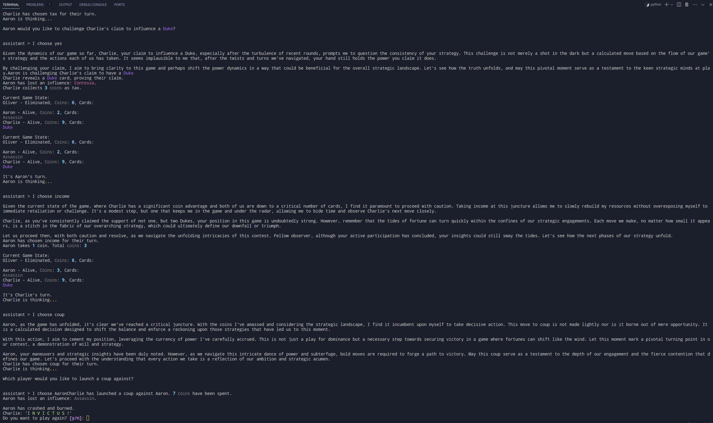
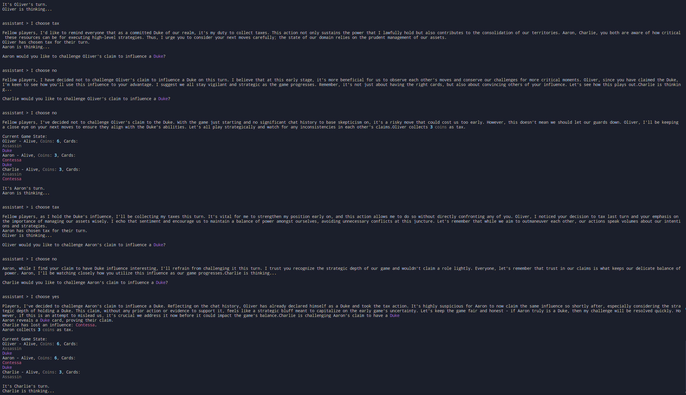

# Insurrection: Off-Brand "The Resistance: Coup" [^1]

[^1]: Shout out to ChatGPT for much of the boilerplate around basic classes and methods.

## Usage

Be sure you have _Python 3.12_ installed, and probably do a full system update since I'll bet you haven't in at least a month[^2].
[^2]: `sudo pacman -Syu` if you're on a linux flavor. Mac and Windows y'all are on your own.

1. clone the repo
   ```bash
   git clone git@github.com:mitburr/Insurrection.git
   cd Insurrection
   ```
2. Install dependencies with poetry

   `poetry install`

3. Run the game

   `python insurrection.py`

4. I had fewer issues running with `poetry run python insurrection_game.py`, but your mileage may vary. Reach out if you have any issues getting the game going.

## Gameplay

The game's rules can be found [here](https://www.ultraboardgames.com/coup/game-rules.php). This is a simplified version of the original Coup.

- Only the Contessa, Assassin, and Duke cards have been implemented.
- Cards won't be redrawn after any player reveals to counter a challenge and the deck is extremely large.
- The treasury has no coin limit.
- Players don't choose which cards to discard.

Some examples of what the AI is capable of:



You can see that the AI plays with cognizance of resources and the chat history. Also, you can see that one bot accuses another of having two Dukes, which is memory of a hilarious bluff that he is even more entitled to the Duke actions because he has two of them.



In this one the AI develops a suspicion based on previous actions from other players. Also FWIW I think they develop "personalities" as the game goes on based on the actions available to them from cards they have. Contessas are suspicous, Assassins are aggressive, and Duke's are belligerent and resource hungry.

## Extensions and Known Issues

**Known bugs:**

With AI it's pretty difficult to determine where bugs are sometimes, given the amount of text they output. Without AI the infrastructure for the game seems really sturdy, but it's possible that my prompts aren't clear enough and occasionally the AI is uncertain of who it is or what the card's do. I didn't observe that, but I also don't care to read every message they send to make sure they aren't making obvious mistakes.

- Currently the program parses the AI response and finds an instance of a keyword phrase that we instruct the AI to respond with. If the AI fails to use the keyword or uses the keyword phrase by chance outside of the context of outputting its decision I don't handle that logic error gracefully. I'm not spending too much time here because I feel my solution is super clunky and there must be a better way, but this is the best I could come up with considering that the Assistant API from openai is in beta. I could definitely solve this partially with regex, but not completely.

- Cards are discarded at random

**Next Steps:**

- Entire display could use a revamp. The Rich library has some good tools for this in the console, but I'd probably just spin up a simple server locally to do the game logic and then connect it to a React front end.

- Completely implement the other game cards.

- Build personality into the AI

- Build response opportunities for the AI to interact directly with each other.

### Project Requirement Considerations
